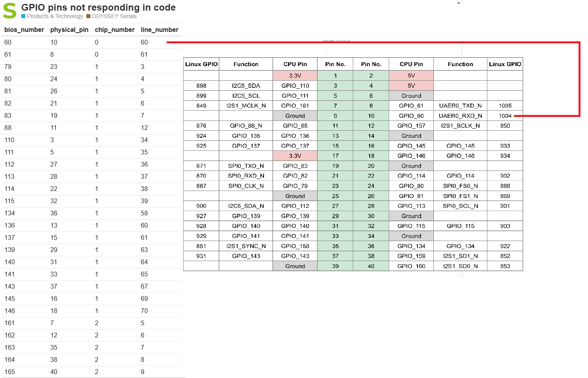

<h1>Task 4.5 Working with Git. Making ROS script (simple).</h1>
Motor control via gpio.

Pictures.

 

_Links._
Board testing [Seeed Odyssey x86J4125 (Celeron)](https://wiki.seeedstudio.com/ODYSSEY-X86J4105-GPIO/)
Simple [control motors, LM293](https://business.tutsplus.com/ru/tutorials/%D1%83%D0%BF%D1%80%D0%B0%D0%B2%D0%BB%D0%B5%D0%BD%D0%B8%D0%B5-%D0%BC%D0%BE%D1%82%D0%BE%D1%80%D0%B0%D0%BC%D0%B8-%D0%BF%D0%BE%D1%81%D1%82%D0%BE%D1%8F%D0%BD%D0%BD%D0%BE%D0%B3%D0%BE-%D1%82%D0%BE%D0%BA%D0%B0-%D1%81-%D0%BF%D0%BE%D0%BC%D0%BE%D1%89%D1%8C%D1%8E-python-%D0%BD%D0%B0-raspberry-pi--cms-20051https://business.tutsplus.com/ru/tutorials/%D1%83%D0%BF%D1%80%D0%B0%D0%B2%D0%BB%D0%B5%D0%BD%D0%B8%D0%B5-%D0%BC%D0%BE%D1%82%D0%BE%D1%80%D0%B0%D0%BC%D0%B8-%D0%BF%D0%BE%D1%81%D1%82%D0%BE%D1%8F%D0%BD%D0%BD%D0%BE%D0%B3%D0%BE-%D1%82%D0%BE%D0%BA%D0%B0-%D1%81-%D0%BF%D0%BE%D0%BC%D0%BE%D1%89%D1%8C%D1%8E-python-%D0%BD%D0%B0-raspberry-pi--cms-20051)

